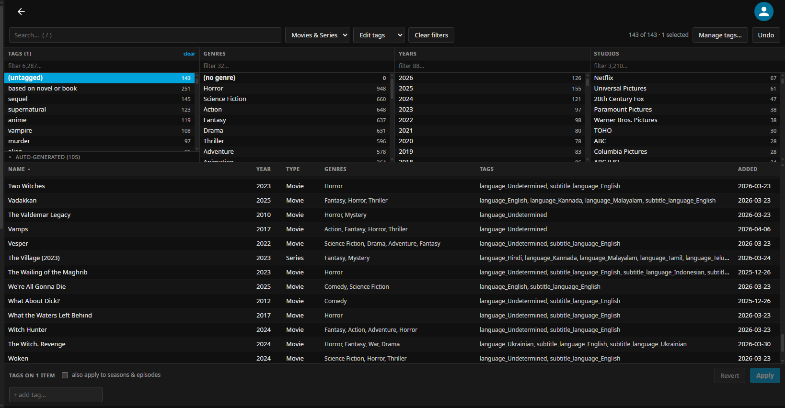

# Tag Studio

A full-screen bulk tag and genre manager for Jellyfin, modelled on the iTunes 2004–2005
column browser: filter panes narrow a sortable table, you multi-select rows, and edit tags
in bulk from a dock at the bottom.

Built for **Jellyfin 10.11**.



## Why

Jellyfin's built-in metadata editor works one item at a time. There is no way to select
forty films and add a tag to all of them, no way to rename a tag across a library, and no
way to find the items you never got round to tagging.

Third-party taggers exist, but they go through `POST /Items/{itemId}` — an endpoint that
expects a complete `BaseItemDto` and has a long history of 400/500 failures on partial
payloads ([#10724](https://github.com/jellyfin/jellyfin/issues/10724),
[#12646](https://github.com/jellyfin/jellyfin/issues/12646)).

Tag Studio runs server-side and mutates `BaseItem.Tags` through `ILibraryManager`, so bulk
writes never touch that endpoint.

## Features

- **Column browser** — Tags, Genres, Years and Studios. OR within a pane, AND across panes,
  the same semantics as iTunes. Each pane is virtualized and filterable.
- **Tri-state tag chips** — a tag on *every* selected item shows solid; on *some* it shows
  hatched with a `3/12` count. Click a hatched chip to apply it to all, a solid one to
  remove it from all. Nothing is written until you press Apply.
- **Vocabulary management** — rename, merge and delete values across the whole library.
- **Duplicate detection** — values that match after case and punctuation are stripped get
  flagged, and you choose which spelling survives. Visually identical spellings are escaped
  (`·` for a space, `U+00A0` for a hidden character) so the choice is meaningful.
- **Undo** — every operation is journalled before and after.
- **Hover cards** — synopsis, type, year and genres without leaving the table.

## Installation

### From the plugin catalog

1. **Dashboard → Plugins → Repositories → +**
2. Add this manifest URL:
   ```
   https://raw.githubusercontent.com/jarandhel/jellyfin-tag-studio/main/manifest.json
   ```
3. **Dashboard → Plugins → Catalog → Tag Studio → Install**
4. Restart Jellyfin.
5. Open **Tag Studio** from the dashboard navigation.

### Manually

1. Download the ZIP from [Releases](https://github.com/jarandhel/jellyfin-tag-studio/releases),
   or build it yourself (see below).
2. Extract it into `<jellyfin-data>/plugins/Tag Studio_<version>/`.
3. Restart Jellyfin.

Jellyfin cannot unload a plugin assembly, so each new version needs its own version-stamped
folder. The build script handles that.

## Design notes

Most of the non-obvious choices exist for a specific reason. These are the ones worth
knowing before changing anything.

### Locking is what makes an edit durable

`MetadataService.MergeBaseItemData` guards every field:

```csharp
if (!lockedFields.Contains(MetadataField.Tags)) {
    if (replaceData || target.Tags.Length == 0) { target.Tags = source.Tags; }
    else { target.Tags = target.Tags.Concat(source.Tags).Distinct(...).ToArray(); }
}
```

A *Replace all metadata* refresh silently discards unlocked tags. So every edit adds
`MetadataField.Tags` (or `.Genres`) to the item's `LockedFields`. Disable with
`AutoLockEditedFields` if you would rather providers keep overwriting.

### NFO sidecars are skipped by default

`LibraryManager.UpdateItemsAsync` runs the metadata savers **once per item** before its
single batched repository write, and `ItemUpdateType.MetadataEdit` (16) outranks the NFO
saver's minimum (8). A naive implementation therefore writes a sidecar for every edited
item — thousands of disk writes on a large selection.

It is usually pointless, too. If Radarr or Sonarr manage your library, their Kodi/Emby
metadata connection regenerates those NFO files without a `<tag>` element, stripping
anything written there. Durability comes from locked fields plus the operation journal
instead, and updates are issued as `MetadataImport`, which sits below the saver threshold.

Set `WriteNfoOnEdit` if Jellyfin genuinely owns the NFO files for your libraries.

*(Reassuringly, `BaseNfoParser` only ever calls `item.AddTag(...)` and never clears `Tags`,
so a tagless NFO cannot erase tags from the database on a normal refresh.)*

### Queries ask for as little as possible

`BaseItemRepository.ApplyNavigations` gates its eager loads on `DtoOptions`:

```csharp
if (filter.DtoOptions.ContainsField(ItemFields.ProviderIds)) ... Include(e => e.Provider);
if (filter.DtoOptions.ContainsField(ItemFields.Settings))    ... Include(e => e.LockedFields);
if (filter.DtoOptions.EnableUserData)                        ... Include(e => e.UserData);
if (filter.DtoOptions.EnableImages)                          ... Include(e => e.Images);
```

The default `DtoOptions` requests everything, which on an `AsSingleQuery` cartesian-joins
four collections across the library. Asking only for `ItemFields.Settings` — the one field
actually read — took the facets pass on a ~2,200 item library from 4.5s to 0.4s.

### Reserved characters

`LibraryOptions.CustomTagDelimiters` lists characters Jellyfin splits tag strings on
(commonly `/ | ; \`). A tag containing one would be torn into pieces on the next refresh,
so the real delimiters are read from every library and the UI rejects names containing them.

### "Untagged" means "no tag you chose"

Counting `Tags.Length == 0` is meaningless on a library where something else tags
everything. Plugins such as Language Tags write `language_*` and `subtitle_language_*` onto
nearly every item, and Jellyfin's TMDB provider imports keywords directly as tags unless
`ExcludeTagsMovies`/`ExcludeTagsSeries` are set:

```csharp
foreach (var keyword in movieResult.Keywords.Keywords)
    movie.AddTag(keyword.Name);
```

On one test library the naive count reported **0 untagged** while 154 items in fact carried
nothing but autotags. `HasUserTags` ignores anything matching a configured machine prefix,
so `(untagged)` finds items with no tag the user chose. Machine-prefixed tags are also
grouped separately in the browser and excluded from bulk delete, since removing a
provider-supplied tag from an unlocked item just brings it back on the next refresh.

### How a bulk write is applied

Edits are collected and written through `ILibraryManager.UpdateItemsAsync`, which issues one
repository transaction per batch rather than one per item. Items are grouped by parent
first, because that call also invalidates the parent folder's cached children — batching
unrelated parents together would leave stale caches.

Merging is a single journalled operation, not a chain of renames. `/Merge` gathers the union
of items carrying any source spelling and issues one `ApplyAsync` with every source in
`Remove` and the survivor in `Add`, so collapsing three variants undoes in one step.
`/Rename` is a one-source merge.

The operation journal is written only *after* a successful save, so undo can never offer to
roll back changes that were not persisted.

Child propagation (series → seasons/episodes) mirrors Jellyfin's own delta logic from
`ItemUpdateController`, respecting each child's `LockedFields`. It is an explicit
per-operation toggle, not a hidden default.

### Reaching the UI

`PluginPageInfo.EnableInMainMenu` is the native mechanism — it drives both the dashboard
navigation entry and the plugin's settings link:

```js
var r = pages.filter(p => p.PluginId === id);
return r.length === 1 ? r[0] : r.find(p => p.EnableInMainMenu) || r[0];
```

Registration with [Plugin Pages](https://github.com/IAmParadox27/jellyfin-plugin-pages) is
also attempted, entirely by reflection so there is no hard dependency — but it is secondary,
since that plugin serves the *user* drawer and Tag Studio is an admin tool.

The page is served as an HTML fragment, because the host inserts it with
`createContextualFragment`, which drops `html`/`head`/`body` wrappers (though it does execute
scripts, unlike `innerHTML`). Theme is detected from the surface actually rendered on rather
than `prefers-color-scheme`, which reports the OS preference and says nothing about which
Jellyfin theme is active.

## Configuration

| Setting | Default | Purpose |
|---|---|---|
| `AutoLockEditedFields` | `true` | Lock edited fields against provider overwrite |
| `MachineTagPrefixes` | `language_;subtitle_language_` | Tags treated as machine-generated |
| `WriteNfoOnEdit` | `false` | Run metadata savers on edit (writes NFO sidecars) |
| `PropagateToChildrenByDefault` | `false` | Default state of the seasons/episodes toggle |
| `BatchSize` | `500` | Items per repository transaction |
| `MaxQueryPageSize` | `500` | Maximum rows per query page |
| `SnapshotRetention` | `50` | Operations kept for undo |

## Keyboard

`/` search · `Ctrl+A` select all · `Ctrl+Z` undo · `Esc` clear selection ·
click / ctrl-click / shift-click in both the panes and the table

## Build

Requires the **.NET 9 SDK** and **Node 18+**.

```powershell
./build.ps1     # Windows
```

```bash
./build.sh      # Linux / macOS
```

The plugin itself is platform independent - `net9.0`, no `RuntimeIdentifier`, every path
through `Path.Combine` or Jellyfin's `IApplicationPaths` - so a DLL built on any OS runs
on any Jellyfin host. Only the deploy scripts differ, and only in where they look for the
toolchain and the data directory (`/var/lib/jellyfin`, `/config` for the linuxserver.io
image, or `%ProgramData%\Jellyfin\Server`).

Builds the SPA, compiles the plugin, deploys it to a version-stamped plugin folder, and
copies the bundle to a location the plugin prefers over its embedded copy — so UI-only
changes take effect on a browser refresh and only C# changes need a restart.

Override paths with environment variables if your toolchain or server lives elsewhere:

```powershell
$env:TAGSTUDIO_DOTNET   = 'C:\path\to\dotnet.exe'
$env:TAGSTUDIO_NPM      = 'C:\path\to\npm.cmd'
$env:TAGSTUDIO_JELLYFIN = 'C:\ProgramData\Jellyfin\Server'
```

Bump `<Version>` in the csproj for each deploy: Jellyfin holds a loaded plugin's DLL open,
so a rebuild cannot replace it in place.

## Repository layout

```
src/Jellyfin.Plugin.TagStudio/
  Api/TagStudioController.cs       JSON API, RequiresElevation
  Api/TagStudioWebController.cs    serves the SPA, anonymous
  Services/MetadataWriter.cs       the write path, batching, auto-locking
  Services/LibraryQueryService.cs  facets and item queries
  Services/OperationJournal.cs     before/after snapshots for undo
  Services/PluginPageRegistrar.cs  optional Plugin Pages registration
web/                               Preact + Vite source, bundled to one file
```

## API

All under `/TagStudio`, all requiring an elevated token except the SPA itself.

| Method | Route | Purpose |
|---|---|---|
| GET | `/Facets` | tags, genres, years, studios with counts |
| GET | `/ReservedCharacters` | delimiter characters to reject |
| POST | `/Query` | filtered, sorted, paged item rows |
| POST | `/Apply` | bulk add/remove on an item set |
| POST | `/Merge` | collapse several values into one, as one operation |
| POST | `/Rename` | library-wide rename (a one-source merge) |
| POST | `/Delete` | remove a value everywhere |
| GET | `/History` | recent operations |
| POST | `/Undo/{id}` | restore an operation's pre-state |

## Not yet built

- Collections bulk add/remove (needs `ICollectionManager`)
- Snapshot export/import for restoring tags after a library rebuild

## Compatibility

Jellyfin plugins are roughly one minor version compatible; expect to rebuild for 10.12. The
C# layer is deliberately thin — most of the code is the SPA, which is version independent.

Not affiliated with the Jellyfin project.

## License

MIT — see [LICENSE](LICENSE).
